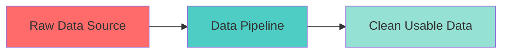
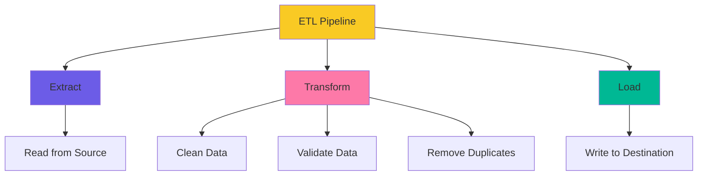
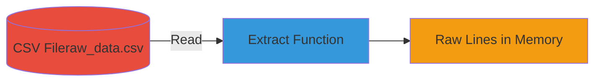
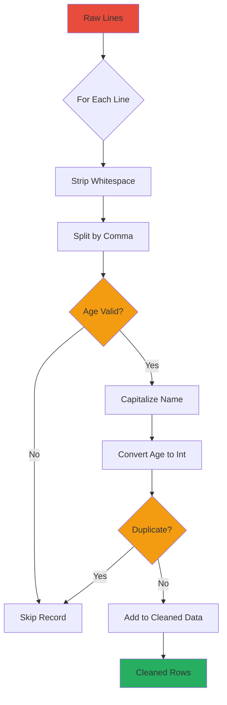
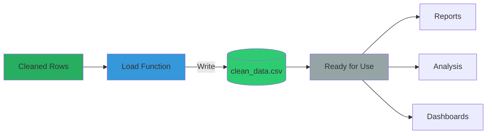
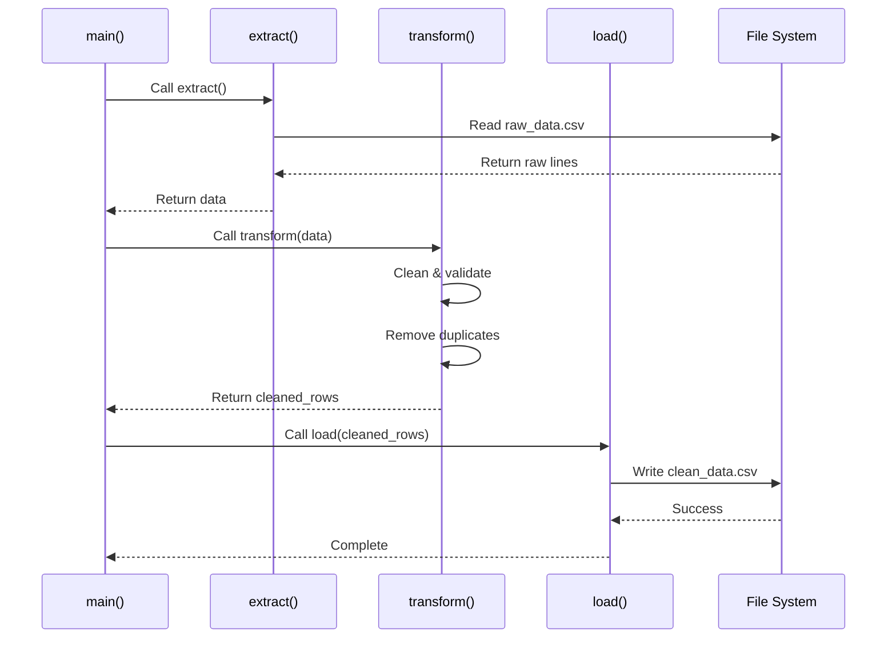
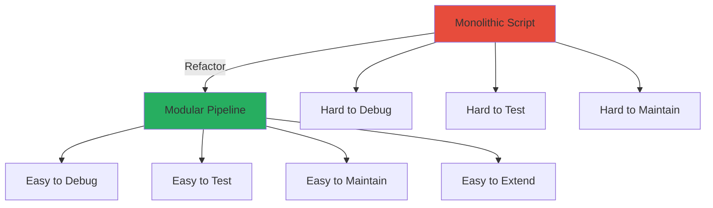
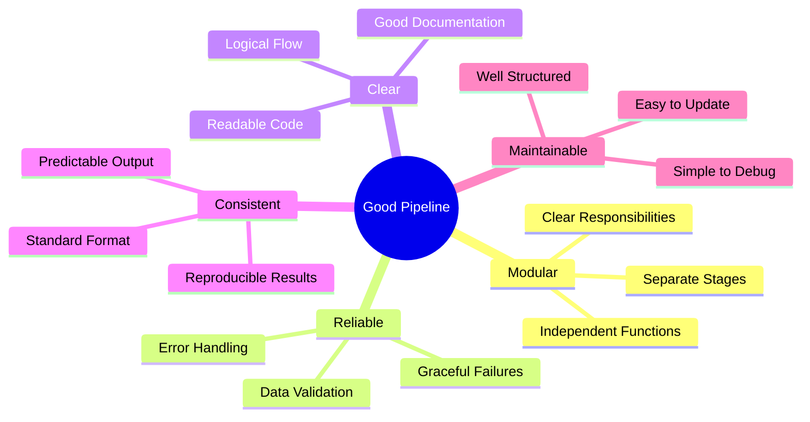
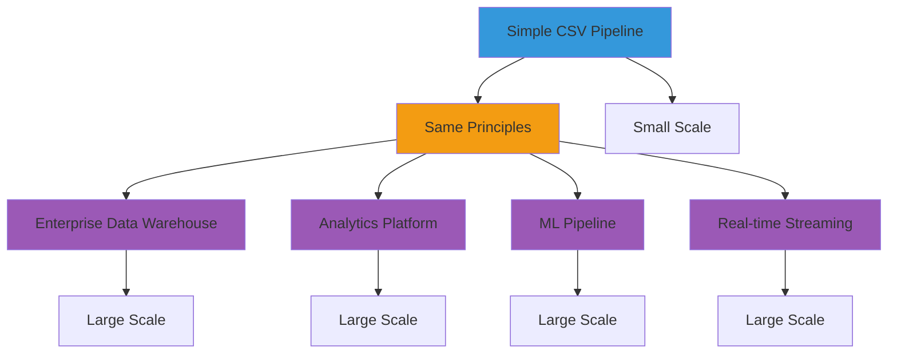

 Day 6 — Understanding Data Pipelines

---

## 🧠 What Is a Data Pipeline?

A **data pipeline** is a structured process that moves data from one place to another while transforming it along the way.

In simple terms:

> A data pipeline takes raw data and turns it into clean, usable data.

It answers four main questions:

1. Where does the data come from?
2. How is the data cleaned or changed?
3. Where does the cleaned data go?
4. How does this process run reliably?



---

## 🔁 What Is ETL?

Most pipelines follow a pattern called **ETL**:

- **E** → Extract  
- **T** → Transform  
- **L** → Load  

Let's connect this directly to the code we wrote in Week 1.



---

## 1️⃣ Extract — Getting the Data

Extraction means reading data from a source.

In our previous code, we extracted data from a CSV file:

```python
with open("raw_data.csv") as f:
    lines = f.readlines()
```

**This is the Extract step.**

We are simply collecting raw data.



---

## 2️⃣ Transform — Cleaning the Data

Transformation is where the real work happens.

In Week 1, we did things like:

- Removing whitespace
- Capitalizing names
- Converting age to integers
- Skipping invalid values
- Removing duplicates

Example transformation logic:

```python
cleaned_rows = []
seen = set()

for line in lines:
    name, age = line.strip().split(",")

    if age == "not_available":
        continue

    name = name.strip().capitalize()
    age = int(age)

    identifier = (name, age)

    if identifier not in seen:
        seen.add(identifier)
        cleaned_rows.append({"name": name, "age": age})
```

**This is the Transform step.**

We:
- Validated data
- Cleaned formatting
- Removed bad records
- Removed duplicates

Transformation turns raw data into usable data.



---

## 3️⃣ Load — Saving the Clean Data

Loading means saving the cleaned data somewhere.

In our previous work, we wrote the cleaned data into a new file:

```python
with open("clean_data.csv", "w") as f:
    for row in cleaned_rows:
        f.write(f"{row['name']},{row['age']}\n")
```

**This is the Load step.**

Now the cleaned data is ready for:
- Reports
- Analysis
- Dashboards
- Further processing



---

## 🏗 Turning Our Script into a Proper Pipeline

Originally, everything was in one long script.

Now we structure it properly:

```python
def extract():
    with open("raw_data.csv") as f:
        return f.readlines()

def transform(lines):
    cleaned_rows = []
    seen = set()

    for line in lines:
        name, age = line.strip().split(",")

        if age == "not_available":
            continue

        name = name.strip().capitalize()
        age = int(age)

        identifier = (name, age)

        if identifier not in seen:
            seen.add(identifier)
            cleaned_rows.append({"name": name, "age": age})

    return cleaned_rows

def load(cleaned_rows):
    with open("clean_data.csv", "w") as f:
        for row in cleaned_rows:
            f.write(f"{row['name']},{row['age']}\n")

def main():
    data = extract()
    cleaned = transform(data)
    load(cleaned)

if __name__ == "__main__":
    main()
```

Now we have a proper pipeline structure:

**Extract → Transform → Load**

Each stage has a clear responsibility.



---

## 🎯 Why This Structure Matters

Separating the stages makes the system:

- ✅ **Easier to read**
- ✅ **Easier to debug**
- ✅ **Easier to extend**
- ✅ **More professional**
- ✅ **Closer to real-world data engineering systems**

Instead of writing scripts…

**We are now designing systems.**



---

## 🛡 What Makes a Good Pipeline?

A good pipeline is:

1. **Modular** (separate stages)
2. **Reliable** (handles bad data)
3. **Clear** (easy to understand)
4. **Consistent** (predictable output)
5. **Maintainable** (easy to improve later)



---

## 🧩 The Bigger Picture

This simple CSV cleaning exercise is actually the foundation of:

- Production data systems
- Data warehouses
- Analytics platforms
- Machine learning pipelines

Even large companies follow the same idea:

**Extract → Transform → Load**

The only difference is scale and infrastructure.



---

## 📝 Summary

### A data pipeline:
- Moves data from source to destination
- Cleans and validates data
- Structures processing into clear stages

### ETL stands for:
- **Extract** (read data)
- **Transform** (clean data)
- **Load** (save data)

### Key Takeaway:
Our Week 1 cleaning script was already a small pipeline.

Day 6 is about recognizing that structure and implementing it properly.

```mermaid
graph LR
    A[Week 1 Script] -->|Recognition| B[ETL Pattern]
    B -->|Refactoring| C[Proper Pipeline]
    C -->|Foundation| D[Production Systems]
    
    style A fill:#e74c3c
    style B fill:#f39c12
    style C fill:#27ae60
    style D fill:#3498db